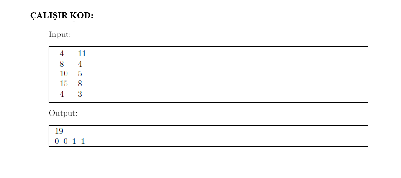
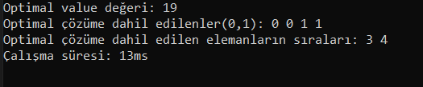
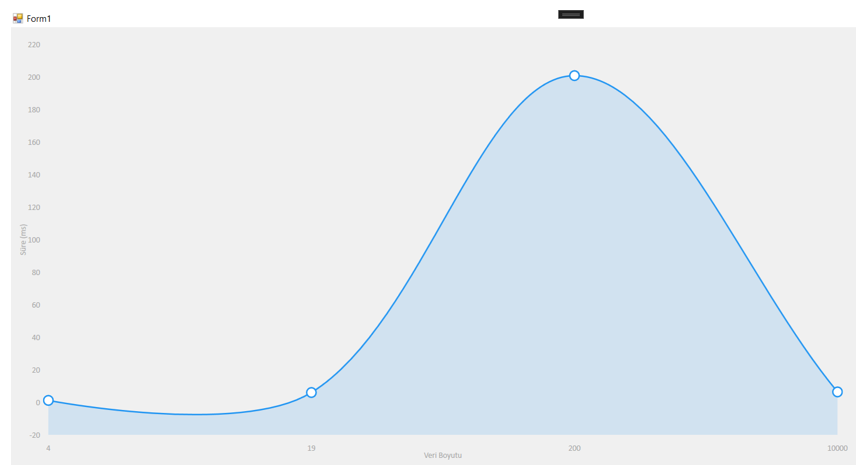

<h1>Knapsack Problem(Sırt Çantası Problemi)</h1>

Knapsack problem(sırt çantası problemi), ağırlıkları ve değerleri verilen bir dizi eşyanın(nesnenin) belirli kapasiteli çantaya toplam değerin en yüksek olacak şekilde ve çantanın kapasitesini aşmayarak ağırlık ve değerlerin göz önünde bulundurulmasıyla bu eşyaları çantaya en optimal şekilde yerleştirme problemidir. Bu ödevin amacı ise işte bu en optimal sonucu bularak hangi eşyaların çantaya yerleştirilmesi ve bu süreçte zamanı da verimli bir şekilde kullanıp en az maliyetle bu problemi çözmektir. Bu projede ise Knapsack Problem(Sırt Çantası Problemi)'nin dinamik programlama ile çözümü ele alınmıştır.
Dinamik programlama düşük boyutlu dosyalar için en iyi çözümü üretir ancak yüksek boyutlu 
dosyalar için bu işlem oldukça maliyetli olacaktır bunun yerine farklı algoritmalar(ör:greedy,evrimsel algoritmalar vs.)tercih edilebilir.

<b>Örnek:</b>

  

<h3>1. Geliştirme Ortamı ve Kullanılan Dil</h3>
Visual Studio (Console Application (.Net)) - C#

<h3>2. Çalıştırılan Farklı Girdi Dosyalarına Göre Ortaya Çıkan Sonuç</h3>

Şekilde 4,19,200,10000 boyutlu dosyalar için boyut-zaman grafiği görülmektedir, burada 4,19 ve 200 boyutlu dosyalar için dinamik programlama, 10000 boyutlu dosya için ise greedy algoritması kullanılmıştır. Grafikte 4 boyutlu dosyadan 200 boyutlu dosyaya doğru gidilirken boyut arttığından çözülme zamanı da artmaktadır ancak dinamik programlamadan ötürü en iyi sonucu da bulabilmekteyiz. Bilindiği üzere dinamik programlama verilen problem için en iyi ve en optimal çözümü üretir ancak verilen problemde eğer eleman sayısı çok fazla ve bu elemanların boyutları yine çok yüksek ise burada dinamik programlama ile bu problemin çözülme durumu ne yazık ki çok düşük olacak, aynı zamanda maliyeti(zaman, memory kullanımı) de artıracaktır. İşte bu sebeplerle buradaki 10000 boyutlu dosyada olduğu gibi çok yüksek boyutlu dosyalarda hızlı bir şekilde sonuca gitmek ve zamanı daha verimli ve etkin, maliyeti de düşürmek için greedy algoritması çözümüne gidildi. Grafikte de bu çözümün pozitif etkisini görebilmekteyiz. Ancak greedy çözümün dezavantajı ise en iyi ve optimal sonuca götürmede kötü bir çözüm olmasıdır. Burada 10000 boyutlu dosyada zaman ve memory konusunda bize fayda sağladı fakat en iyi ve optimal çözüme ulaşmada ise maalesef sorun yaşattı. Sonuç olarak grafikte görüldüğü üzere 200 boyutlu dosyaya kadar dinamik programlama bize uygun sürede optimal çözümler üretti, ancak grafikte dikkat edilirse 10000 boyutlu dosyada yine dinamik programlamayı kullansaydık zaman çok artıcaktı belki de çözümlenemeyecekti bu yüzden greedy algoritmayı kullanarak grafikte görüldüğü üzere süre oldukça düştü ve hızlı bir şekilde çözüme gidildi.

<h3>3. Kurulum</h3>
Uygulamayı indirdikten sonra start ikonuna basarak çalıştırabilirsiniz.
  
<b>Not: </b>Kullanılan girdi dosyalarını "Datas" klasörü altında bulabilirsiniz.
